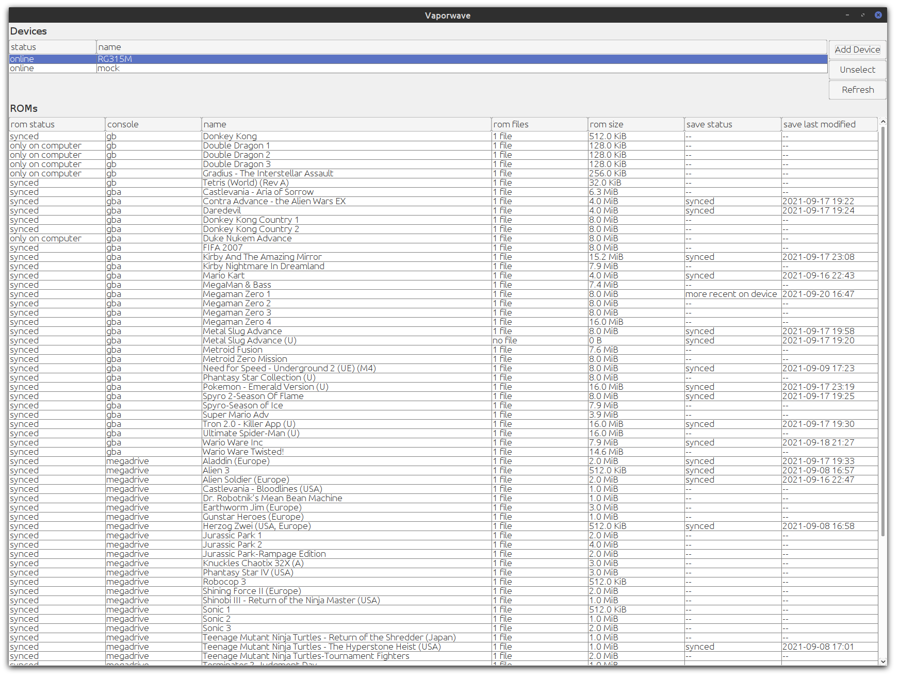

<a href="https://paypal.me/benckx/2">

</a>

# About

_Vaporwave_ is a tool to manage, synchronize and backup ROMs and save files between different devices (computer, retro
handhelds, smartphone, etc.) It's inspired in part from the e-books
manager [calibre](https://github.com/kovidgoyal/calibre).

Name is based on _Steam_ (as the idea is to manage game and save files between devices). *Vaporwave* is also a term
associated with 80's/90's nostalgia, and therefore with retro gaming.



# Features

- Navigate local ROMs collection
- Add device based on its SSH connection
- Compare ROMs between local computer and devices
- Compare save files between local computer and devices, and detect where the more recent save is stored
- Download/Upload ROMs files from/to devices
- Download/Upload save files from/to devices
- Tested with [ArkOS](https://github.com/christianhaitian/arkos/wiki) running on a RG351M device.

# Future Changes

- Add proper executable for Windows and Linux
- Test/Add support for other devices and OS. It's likely some OS store their ROMs differently.
- Add/Remove ROMs from collection
- Update local ROMs folder
- Improve UI/UX (file transfer progress bars, warning when user override save files that seems more recent, etc.)
- Add a function that detects, for each ROM, the most recent save from all the devices, and upload it to all devices.
- Sync with local RetroArch installation as well.
- Add a nice app icon

# How To

## Run

For now, it must be run from IDE. Executables for all OS will be added later.

## Build

```
./gradlew clean build
```

## Update dependencies

```
 ./gradlew dependencyUpdates --refresh-dependencies
```

# Change logs

## Version 1.0

- Navigate local ROMs collection
- Add device based on its SSH connection
- Compare ROMs between local computer and devices
- Compare save files between local computer and devices, and detect where the more recent save is stored
- Download/Upload ROMs files from/to devices
- Download/Upload save files from/to devices
- Tested on [ArkOS](https://github.com/christianhaitian/arkos/wiki) and RG351M device.

# Related Projects:

TODO: ArkOS, RetroOz, sync tool 
